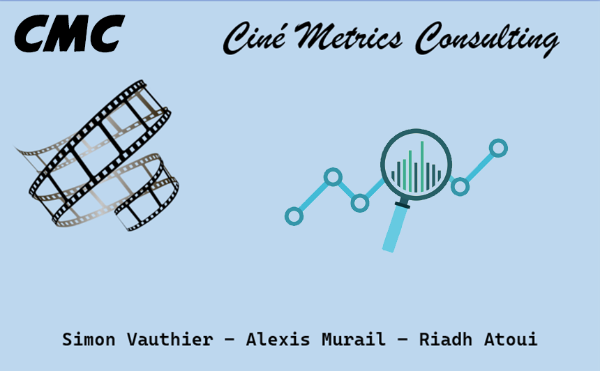

# :clapper: Ciné Metrics Consulting :movie_camera:

Projet réalisé à partir de bases de données open source proposées par IMDb.

Projet réalisé en 6 semaines en équipe de 3 personnes.

 
##
## Sujet :
Le sujet de notre projet est un cinéma de la Creuse en perte de vitesse qui nous mandate afin de se relancer.  
Il nous a été demandé de proposer une étude de la base de données,  
Puis de générer un moteur de recommandations de films.    
##
## Réponse et outils utilisés :
Nous y avons répondu en proposant différentes **visualisations**, à la fois de la base de données mais également de statistiques INSEE de la Creuse.  
Nous avons ensuite généré un outil permettant au cinéma de trouver des sujets destinés à proposer des **semaines thématiques** à ses clients,  
Puis 2 **moteurs de recommandations**, un concernant les films et l'autre uniquement pour les documentaires : via **streamlit**, le client rentre un film/documentaire de son choix et l'algorithme lui propose les plus **proches voisins** de ce film/documentaire.  
Nous avons également proposé en page d'accueil un espace d'**inscription à une newsletter** qui envoie automatiquement un mail au cinéma dès qu'une inscription est faite et qui génère automatiquement un tableau au format CSV contenant les noms et adresses mail des clients inscrits.

La présentation a été réalisée via le logiciel **Canva**.  

##
## Les éléments importants :
* [La présentation CANVA convertie au format PDF](https://github.com/Datalex0/Cine-Metrics-Consulting/blob/65ed30dd3aa2a27c1ee258f2b5a9af30fe2670d9/SRC/CINE%20METRICS%20CONSULTING.pdf) 
* Le code (en python)
* Les fichiers CSV
* [Le lien vers la démonstration Streamlit](https://cine-metrics-consulting.streamlit.app)
* [Le logo d'équipe](SRC/logo.png)

